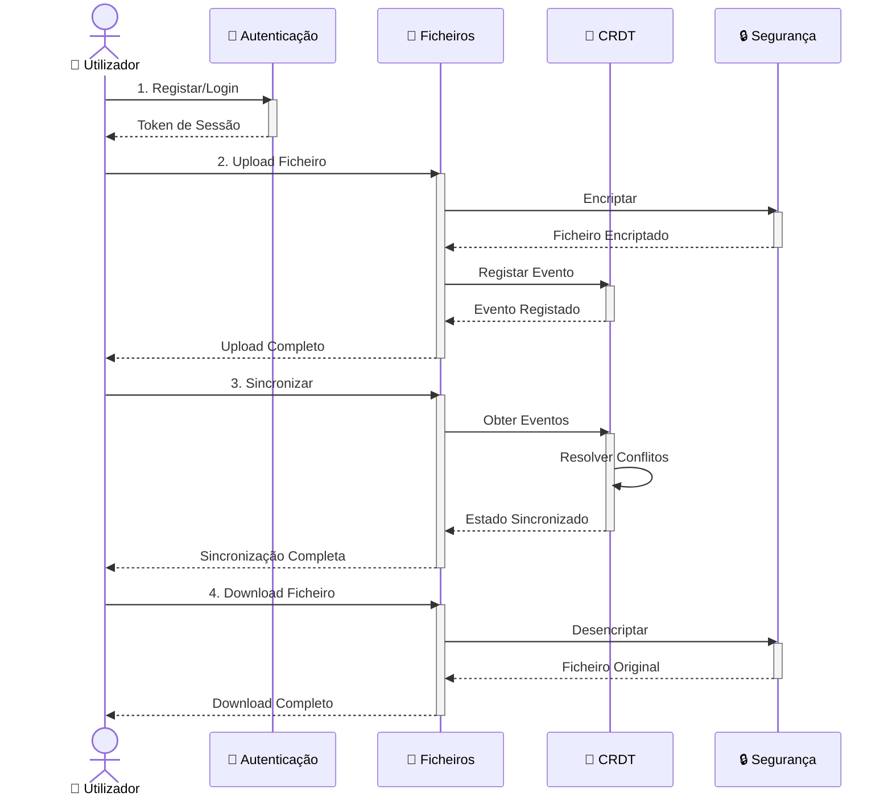

# Diagrama de Casos de Uso - NetGuardian

## Diagrama Principal

```mermaid
graph LR
    subgraph Sistema["�️ NetGuardian System"]
        subgraph Autenticacao["� Autenticação"]
            UC1[Registar Conta]
            UC2[Login]
            UC3[Logout]
        end
        
        subgraph GestaoFicheiros["📁 Gestão de Ficheiros"]
            UC4[Upload Ficheiros]
            UC5[Download Ficheiros]
            UC6[Visualizar Ficheiros]
            UC7[Eliminar Ficheiros]
            UC8[Pesquisar Ficheiros]
            UC9[Filtrar por Categoria]
        end
        
        subgraph Sincronizacao["🔄 Sincronização CRDT"]
            UC11[Sincronizar Dispositivos]
            UC16[Resolver Conflitos]
            UC15[Registar Eventos]
        end
        
        subgraph Administracao["⚙️ Administração"]
            UC10[Gerir Utilizadores]
            UC12[Configurar Sistema]
        end
        
        subgraph Seguranca["🔒 Segurança"]
            UC13[Encriptar Ficheiro]
            UC14[Desencriptar Ficheiro]
        end
    end
    
    User[👤 Utilizador]
    Admin[👥 Administrador]
    
    User --> UC1
    User --> UC2
    User --> UC3
    User --> UC4
    User --> UC5
    User --> UC6
    User --> UC7
    User --> UC8
    User --> UC9
    User --> UC11
    
    Admin --> UC2
    Admin --> UC3
    Admin --> UC4
    Admin --> UC5
    Admin --> UC6
    Admin --> UC7
    Admin --> UC8
    Admin --> UC9
    Admin --> UC10
    Admin --> UC11
    Admin --> UC12
    
    UC4 -.include.-> UC13
    UC5 -.include.-> UC14
    UC4 -.include.-> UC15
    UC7 -.include.-> UC15
    UC11 -.include.-> UC16
    UC11 -.include.-> UC15
    
    style User fill:#4A9EFF,stroke:#2A5F9C,stroke-width:3px,color:#fff
    style Admin fill:#FF6B6B,stroke:#CC5555,stroke-width:3px,color:#fff
    style Sistema fill:#1A1A1A,stroke:#4A9EFF,stroke-width:2px
    style Autenticacao fill:#2A2A2A,stroke:#4A9EFF
    style GestaoFicheiros fill:#2A2A2A,stroke:#4CAF50
    style Sincronizacao fill:#2A2A2A,stroke:#FF9800
    style Administracao fill:#2A2A2A,stroke:#FF6B6B
    style Seguranca fill:#2A2A2A,stroke:#9C27B0
```

## Diagrama Simplificado (Fluxo Principal)

## Atores

### 👤 Utilizador
Utilizador comum do sistema que gere os seus ficheiros pessoais. Pode:
- Autenticar-se no sistema
- Fazer upload/download de ficheiros
- Pesquisar e filtrar ficheiros
- Sincronizar entre dispositivos

### 👥 Administrador
Utilizador com permissões elevadas que gere o sistema. Herda todas as funcionalidades do Utilizador e pode:
- Gerir contas de utilizadores
- Configurar parâmetros do sistema
- Aceder a logs e estatísticas

---

## Casos de Uso Detalhados

### 🔐 Autenticação

#### UC1 - Registar Conta
**Descrição**: Criar uma nova conta de utilizador no sistema  
**Actor**: Utilizador  
**Pré-condições**: Nenhuma  
**Fluxo Principal**:
1. Utilizador acede ao ecrã de registo
2. Preenche username, email e password
3. Sistema valida os dados
4. Sistema cria conta com hash bcrypt
5. Sistema confirma registo

**Pós-condições**: Nova conta criada e activa

#### UC2 - Login
**Descrição**: Autenticar-se no sistema  
**Actor**: Utilizador / Administrador  
**Pré-condições**: Conta já registada  
**Fluxo Principal**:
1. Utilizador introduz credenciais
2. Sistema valida username e password
3. Sistema cria token de sessão
4. Sistema carrega dashboard

**Pós-condições**: Utilizador autenticado com sessão activa

#### UC3 - Logout
**Descrição**: Terminar sessão actual  
**Actor**: Utilizador / Administrador  
**Pré-condições**: Sessão activa  
**Fluxo Principal**:
1. Utilizador clica em Logout
2. Sistema invalida token de sessão
3. Sistema redireciona para login

**Pós-condições**: Sessão terminada

---

### 📁 Gestão de Ficheiros

#### UC4 - Upload Ficheiros
**Descrição**: Enviar ficheiros para o sistema  
**Actor**: Utilizador  
**Pré-condições**: Autenticado  
**Fluxo Principal**:
1. Utilizador selecciona ficheiro
2. Sistema valida tamanho e tipo
3. **<<include>> UC13**: Sistema encripta ficheiro
4. **<<include>> UC15**: Sistema regista evento CRDT
5. Sistema guarda ficheiro
6. Sistema actualiza interface

**Pós-condições**: Ficheiro armazenado e replicado

#### UC5 - Download Ficheiros
**Descrição**: Descarregar ficheiros do sistema  
**Actor**: Utilizador  
**Pré-condições**: Autenticado, ficheiro existe  
**Fluxo Principal**:
1. Utilizador selecciona ficheiro
2. Sistema recupera ficheiro encriptado
3. **<<include>> UC14**: Sistema desencripta ficheiro
4. Sistema envia ficheiro ao utilizador

**Pós-condições**: Ficheiro transferido

#### UC6 - Visualizar Ficheiros
**Descrição**: Ver lista e detalhes dos ficheiros  
**Actor**: Utilizador  
**Pré-condições**: Autenticado  
**Fluxo Principal**:
1. Sistema carrega ficheiros do utilizador
2. Sistema apresenta em grid/lista
3. Sistema mostra metadados (tamanho, data, tipo)

**Pós-condições**: Ficheiros visíveis

#### UC7 - Eliminar Ficheiros
**Descrição**: Remover ficheiros do sistema  
**Actor**: Utilizador  
**Pré-condições**: Autenticado, ficheiro existe  
**Fluxo Principal**:
1. Utilizador selecciona ficheiro
2. Sistema solicita confirmação
3. **<<include>> UC15**: Sistema regista evento de eliminação
4. Sistema remove ficheiro físico
5. Sistema actualiza interface

**Pós-condições**: Ficheiro eliminado (tombstone CRDT)

#### UC8 - Pesquisar Ficheiros
**Descrição**: Procurar ficheiros por nome ou critério  
**Actor**: Utilizador  
**Pré-condições**: Autenticado  
**Fluxo Principal**:
1. Utilizador introduz termo de pesquisa
2. Sistema pesquisa em metadados
3. Sistema apresenta resultados filtrados

**Pós-condições**: Resultados apresentados

#### UC9 - Filtrar por Categoria
**Descrição**: Filtrar ficheiros por tipo/categoria  
**Actor**: Utilizador  
**Pré-condições**: Autenticado  
**Fluxo Principal**:
1. Utilizador selecciona categoria
2. Sistema filtra por extensão
3. Sistema apresenta ficheiros filtrados

**Pós-condições**: Vista filtrada activa

---

### 🔄 Sincronização CRDT

#### UC11 - Sincronizar Dispositivos
**Descrição**: Sincronizar estado entre múltiplos dispositivos  
**Actor**: Utilizador  
**Pré-condições**: Autenticado, múltiplos dispositivos  
**Fluxo Principal**:
1. Utilizador inicia sincronização
2. Sistema recolhe eventos locais
3. Sistema obtém eventos remotos
4. **<<include>> UC16**: Sistema resolve conflitos
5. **<<include>> UC15**: Sistema regista merge
6. Sistema aplica alterações
7. Sistema actualiza interface

**Pós-condições**: Estado sincronizado em todos os dispositivos

#### UC15 - Registar Eventos
**Descrição**: Registar evento no sistema CRDT  
**Actor**: Sistema (interno)  
**Pré-condições**: Operação executada  
**Fluxo Principal**:
1. Sistema cria evento com timestamp
2. Sistema incrementa vector clock
3. Sistema persiste no event store
4. Sistema actualiza snapshot

**Pós-condições**: Evento registado para sincronização

#### UC16 - Resolver Conflitos
**Descrição**: Resolver conflitos de sincronização automaticamente  
**Actor**: Sistema (interno)  
**Pré-condições**: Eventos concorrentes detectados  
**Fluxo Principal**:
1. Sistema compara vector clocks
2. Sistema aplica regra LWW (Last-Write-Wins)
3. Sistema merge estados
4. Sistema regista resolução

**Pós-condições**: Conflito resolvido deterministicamente

---

### ⚙️ Administração

#### UC10 - Gerir Utilizadores
**Descrição**: Criar, editar, eliminar utilizadores  
**Actor**: Administrador  
**Pré-condições**: Autenticado como admin  
**Fluxo Principal**:
1. Admin acede ao painel de gestão
2. Admin visualiza lista de utilizadores
3. Admin executa acção (criar/editar/eliminar)
4. Sistema valida e persiste alterações

**Pós-condições**: Utilizadores actualizados

#### UC12 - Configurar Sistema
**Descrição**: Alterar configurações do sistema  
**Actor**: Administrador  
**Pré-condições**: Autenticado como admin  
**Fluxo Principal**:
1. Admin acede às configurações
2. Admin altera parâmetros
3. Sistema valida configurações
4. Sistema aplica alterações

**Pós-condições**: Sistema reconfigurado

---

### 🔒 Segurança

#### UC13 - Encriptar Ficheiro
**Descrição**: Encriptar ficheiro antes de armazenar  
**Actor**: Sistema (interno)  
**Pré-condições**: Ficheiro a armazenar  
**Fluxo Principal**:
1. Sistema lê ficheiro original
2. Sistema aplica encriptação AES
3. Sistema retorna ficheiro encriptado

**Pós-condições**: Ficheiro encriptado e seguro

#### UC14 - Desencriptar Ficheiro
**Descrição**: Desencriptar ficheiro ao descarregar  
**Actor**: Sistema (interno)  
**Pré-condições**: Ficheiro encriptado, chave válida  
**Fluxo Principal**:
1. Sistema lê ficheiro encriptado
2. Sistema aplica desencriptação AES
3. Sistema retorna ficheiro original

**Pós-condições**: Ficheiro desencriptado

---

## Relacionamentos

- **<<include>>**: Relacionamento de inclusão obrigatória
  - Upload/Eliminar → Registar Eventos
  - Upload → Encriptar
  - Download → Desencriptar
  - Sincronizar → Resolver Conflitos

- **<<extend>>**: Relacionamento de extensão opcional (não utilizado)

- **Generalização**: Administrador herda todas as funcionalidades do Utilizador

---

## Notas Técnicas

### Tecnologias Utilizadas
- **Mermaid**: Diagramas renderizados em Markdown
- **CRDT**: Conflict-free Replicated Data Types para sincronização
- **Event Sourcing**: Rastreamento de todas as operações
- **Bcrypt**: Hash seguro de passwords
- **AES**: Encriptação de ficheiros

### Visualização
Os diagramas Mermaid podem ser visualizados em:
- GitHub (nativo)
- VS Code (com extensão Mermaid)
- Navegadores (com extensões)
- [Mermaid Live Editor](https://mermaid.live/)

Para exportar como PNG:
1. Abra em [Mermaid Live Editor](https://mermaid.live/)
2. Cole o código do diagrama
3. Clique em "Download PNG"
